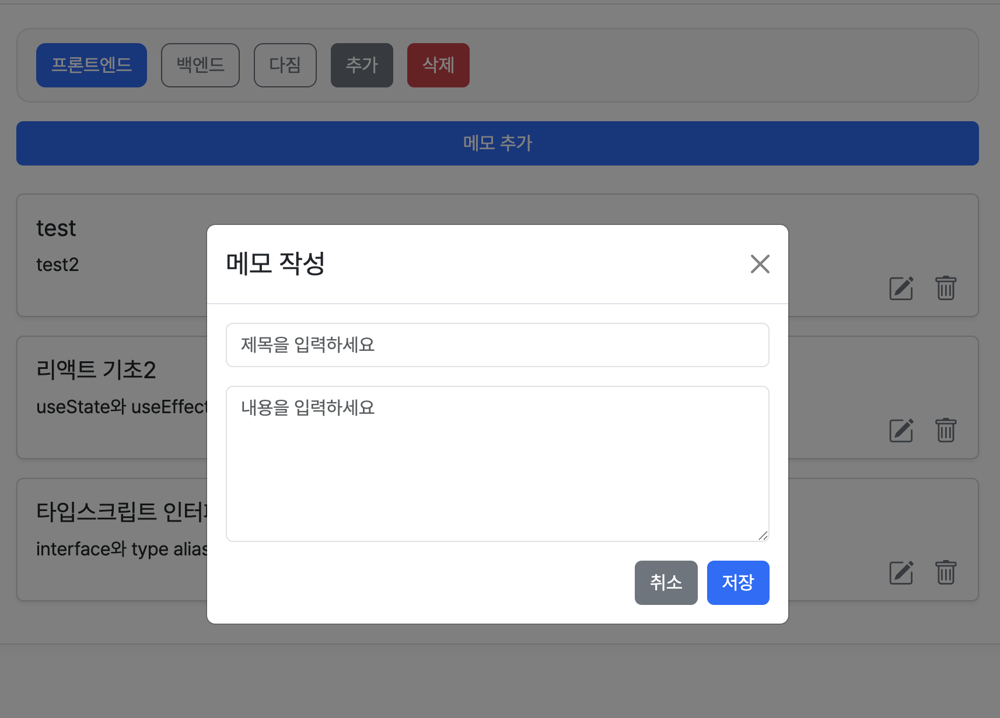

# 🖇 웹 클립보드
> 메모를 쉽게 복사 및 저장 관리할 수 있는 웹 클립보드입니다.

홈화면 | 로그인 화면 | 메모 추가
--|--|--
 |  | 

<br>

## 🔗 Links

- [🌐 사이트 바로가기](https://tony96kimsh.github.io/WebClipboard/)  
- [📘 작업 로그 (Notion)](https://stump-smartphone-024.notion.site/React-Oauth-Cloud-DB-1e7f398452c380489bf0dbc33195c385?pvs=4)

---

## 📌 프로젝트 개요

### 제작 배경

QA 업무 중 이슈 보고서를 복사해 사용하는 일이 잦았고, 이를 위해 노션이나 메모앱을 활용하곤 했습니다. 하지만 다른 메모들과 섞여 있어 원하는 메모를 찾는 데 시간이 오래 걸렸고, 윈도우 클립보드 기능도 한계가 있었습니다.

그래서 복사와 메모를 효율적으로 분리하고 관리할 수 있는, **명확한 목적의 웹 클립보드** 앱을 제작하게 되었습니다.

### 기술 스택

- TypeScript
- React
- Google OAuth
- Supabase (Cloud DB, 개발 중)

---

## ✨ 주요 기능

1. 메모 클릭 시 자동 복사
2. 폴더로 메모 분류 가능
3. 로컬 스토리지 저장
4. Google OAuth 로그인
5. (진행 중) 로그인 시 Supabase와 동기화

---

## 🗂 프로젝트 구조

### 레이아웃 구성

- **헤더**: 앱 이름, 로그인/로그아웃
- **메인**:
  - 폴더 선택 메뉴
  - 메모 추가 입력란
  - 메모 리스트
- **풋터**: 깃허브, 이메일, 저작권 정보

---

### 폴더 구조
```
/src
├── App.css
├── App.tsx
├── assets
│   └── react.svg
├── components
│   ├── FolderMenu.css
│   ├── FolderMenu.tsx
│   ├── InsertMemo.tsx
│   ├── MemoList.css
│   ├── MemoList.tsx
│   └── MemoModal.tsx
├── data
│   ├── Folder.ts
│   ├── Memo.ts
│   └── Sample.ts
├── index.css
├── main.tsx
└── vite-env.d.ts
```
### 코드 구조
메모 CRUD 코드
``` tsx
```

구글 Oauth 연결 코드
``` tsx
```

#### 로그인 상태에 따른 DB 사용
초기 렌더
``` tsx
```
메모 추가
``` tsx
```

### DB 구조 (superbase)
folders
- id: UUID (PK)
- name: text
- created_at timestampz
- user_email: text (유저 구분용)
memos
- id: UUID (PK)
- folderId: UUID (FK)
- title: text
- content: text
- created_at: timestampz
- updated_at: timestampz
- user_email: text (유저 구분용)


