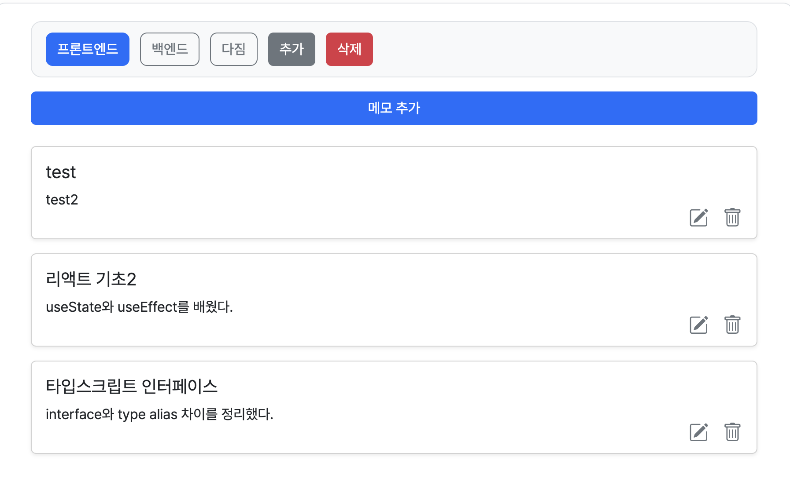

# 🖇 웹 클립보드
> 메모를 쉽게 복사 및 저장 관리할 수 있는 웹 클립보드입니다.

홈화면 | 로그인 화면| 메모 추가
--|--|--|
 | | 

<br>

Links
[🌐 사이트 바로가기](https://tony96kimsh.github.io/WebClipboard/)  
[📘 작업 로그(노션)](https://stump-smartphone-024.notion.site/React-Oauth-Cloud-DB-1e7f398452c380489bf0dbc33195c385?pvs=4)

## 프로젝트 개요

### 제작 배경


### 기술 스택
TypeScript, React

### 주요 기능
1. 


## 프로젝트 구조

### 레이아웃 구성

### 폴더 구조
```
/src
├── App.css
├── App.tsx
├── assets
│   └── react.svg
├── components
│   ├── FolderMenu.css
│   ├── FolderMenu.tsx
│   ├── InsertMemo.tsx
│   ├── MemoList.css
│   ├── MemoList.tsx
│   └── MemoModal.tsx
├── data
│   ├── Folder.ts
│   ├── Memo.ts
│   └── Sample.ts
├── index.css
├── main.tsx
└── vite-env.d.ts
```
### 코드 구조

### DB 구조 (superbase)
folders
- id: UUID (PK)
- name: text
- created_at timestampz
- user_email: text (유저 구분용)
memos
- id: UUID (PK)
- folderId: UUID (FK)
- title: text
- content: text
- created_at: timestampz
- updated_at: timestampz
- user_email: text (유저 구분용)